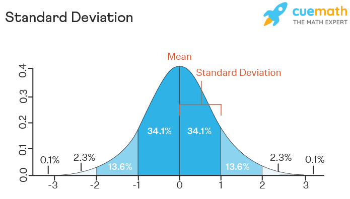

```{r}
#load the data from a file
data<-read.table("mock_data.csv",sep=",",header=TRUE)
#view the data on screen
data
```

## Access columns and subsets

```{r}
#access a specific column in the data
data$Completeness

#create subsets
data_ce<-data[which(data["Treatment"] == 'ce'),]
data_nce<-data[which(data["Treatment"] == 'nce'),]
```

```{r}
#create subsets (OR operator)
data_ce<-data[which(data["Treatment"] == 'ce' | data["Treatment"] == 'nce'),]

#create subsets (AND operator, numeric values)
data_years <-data[which(data["ProgYears"] == 4 & data["Time"] == 60),]

# Show only the first 3 rows of data_years
head(data_years, 3)
```

# Operations

## Mean operation

```{r}
mean(data_ce$Completeness)
mean(data_nce$Completeness)
```

## Median

```{r}
median(data_ce$Completeness)
median(data_nce$Completeness)
```

## Percentile

In general $x_p$ denotes the percentile --\> where $p_\%$ of the samples lies below this value

```{r}
#x33 percentile achieved with code examples
quantile(data_ce$Completeness, 0.33)
quantile(data_nce$Completeness, 0.33)
```

## Standard deviation

Quantifies the amount of variation or dispersion of a set of data values. The standard deviation on
$n$ data points $x_1, …, x_n$

$\sigma = \sqrt{\frac{1}{N} \sum_{i=1}^{N} (x_i - \mu)^2}$



```{r}
sd(data_ce$Completeness)
sd(data_nce$Completeness)
```

## Range

The distance between the maximum and the minimum data value.

```{r}
distribution = data$Completeness
max(distribution) - min(distribution)
```

# Visual rapresentation

## Box-plot

Box plot: good for visualizing the dispersion and skewedness of data

```{r}
boxplot(data_nce$Completeness, data_ce$Completeness,col="gray", boxwex = 0.25, axes=TRUE, names=c("NCE","CE"))
# boxwex: controls the width of the boxes in the boxplot. 

```

## Export graphs

```{r}
pdf("boxplot.pdf") # Open a PDF device to save the plot
boxplot(data_nce$Completeness, data_ce$Completeness,col="gray", boxwex = 0.25, axes=TRUE, names=c("NCE","CE"))
dev.off() # Close the PDF device
```

# Measures of dependency

## Pearson [Normally distributed]

Pearson correlation coefficient ($r$), a single number that quantifies how much two data sets, $x_i$
and $y_i$, vary together. The (Pearson) correlation coefficient is meaningful for data that is
**normally distributed**

The value of $r$ is between $1$ and $-1$, and if there is no correlation equals zero. - **\|r\| \>
0.7**: Strong correlation - **\|r\| \> 0.5**: Moderate correlation - **\|r\| \> 0.3**: Weak
correlation

```{r}
#correlation between experience and completeness
cor(data$ProgYears, data$Completeness, method="pearson")
```

## Spearman, Kendall [Non-Normally distributed]

If the data is far from **normally distributed**, we can apply. • the Spearman rank-order
correlation coefficient • the Kendall rank-order correlation coefficient

```{r}
cor(data$ProgYears, data$Completeness, method="spearman")
cor(data$ProgYears, data$Completeness, method="kendall")
```

# Hypothesis testing

## Important Probabilities in Hypothesis Testing

Three important probabilities concerning hypothesis testing are:

1.  **α**: The probability of a Type-I error\
    $\alpha = P(\text{reject } H_0 \mid H_0 \text{ is true})$

2.  **β**: The probability of a Type-II error\
    $\beta = P(\text{not reject } H_0 \mid H_0 \text{ is false})$

3.  **Power**: The probability of correctly rejecting the null hypothesis when it is false\
    $\text{Power} = 1 - \beta = P(\text{reject } H_0 \mid H_0 \text{ is false})$

### P-value and Significance Level

Statistical tests return a p-value, which is the lowest possible significance level (**α**) with
which it is possible to reject the null hypothesis. - If the **p-value \< 0.05**, we reject the null
hypothesis.

## Parametric vs Non Parametric

Tests can be classified into **parametric** and **non-parametric** tests:

### Parametric Tests

-   Parametric tests are based on a model that involves a specific distribution.
-   In most cases, it is assumed that some of the parameters involved are **normally distributed**.
-   **Higher power**: The **power** of parametric tests is usually higher than non-parametric tests
    $\longrightarrow$ meaning they have a greater ability to detect an effect when one exists.

### Non-Parametric Tests

-   Non-parametric tests do not make the same type of assumptions of the distribution of parameters
    as parametric tests.
-   They can be used when the data doesn't meet the assumptions required by parametric tests.
-   **Flexibility**: Non-parametric tests can be used instead of parametric tests, but not vice
    versa.

## Shapiro-Wilk [Normal distribution test]

Shapiro-Wilk test for testing the normality of a distribution $\longrightarrow$ this can be useful
to decide for a parametric and non-parametric test and measure the dependency

The **null hypothesis** is that the distribution is normally distributed.

```{r}
#Shapiro-Wilk normality test
shapiro.test(data$Completeness)
```

## T-Test [Parametric test]

The t-test is a **parametric** test used to compare two **independent samples**.

```{r}
t.test(data_ce$Completeness, data_nce$Completeness)
```

Parameter **paired**:

-   `paired = FALSE` (default): Assumes the two groups are independent.

-   `paired = TRUE`: Assumes the two groups are related, such as pre-test and post-test data from
    the same subjects.

```{r}
# Example: Independent samples t-test
t.test(data_ce$Completeness, data_nce$Completeness, paired = FALSE)

# Example: Paired samples t-test 
t.test(data_ce$Completeness, data_ce$Time, paired = TRUE)
```

## Mann-Whitney [Non parametric test]

The Mann-Whitney test is a **non-parametric alternative** to the t-test $\longrightarrow$ It is
always possible to use this test instead of the t-test if the assumptions made by the t-test seem
uncertain.

```{r}
wilcox.test(data_ce$Completeness, data_nce$Completeness, paired = FALSE)
# Important parameter: paired=FALSE (default) | paired=TRUE
```

# Effect size

In other words, the farther the effect size from zero, the larger the difference between the two
distributions

Reason for **effect size**:

-   If the **hypotheses** are *rejected* we may draw conclusions regarding the influence of the
    `independent variables` on the `dependent variables.`

-   even if the results of the experiment may be statistically significant, it is not necessarily
    that the result is of any practical importance $\longrightarrow$ It is necessary to study the
    observed effect size of different treatments and based on that draw conclusions and present
    recommendations.

-   

Effect - size, distance between two distributions (difference between them) values:

-   Negligible: $|d| < 0.148$

-   Small: $0.148 <= |d| < 0.33$

-   Medium: $0.33 <= |d| < 0.474$

-   Large: $|d| >= 0.474$

The same guidelines do also apply for negative values.

## Cohen’s d effect size [Parametric]

```{r}
#(mean(firstDistribution) - mean(secondDistribution))/
 # (sd(firstDistribution) - sd (secondDistribution)))


# Separate data by Treatment
ce_group <- data$Completeness[data$Treatment == "ce"]
nce_group <- data$Completeness[data$Treatment == "nce"]

# Calculate the effect size
mean_diff <- mean(ce_group) - mean(nce_group)
pooled_sd <- (sd(ce_group) + sd(nce_group)) / 2
effect_size <- mean_diff / pooled_sd

# Print the effect size
effect_size

```

## Cliff’s delta [Non Parametric]

Need the library `effsize`

```{r}
install.packages("effsize")
```

```{r}
# Generate a sequence of numbers from 1 to 100 with step size of 1
x <- seq(1, 100, by = 1)

# Generate a sequence of numbers from 2 to 101 with step size of 1
y <- seq(2, 101, by = 1)

# Perform a Wilcoxon signed-rank test for paired samples (non-parametric test)
# This is used when comparing two related samples, x and y.
# It tests whether the distributions of the two related samples differ.
wilcox.test(x, y, paired = TRUE)

# Load the 'effsize' library to calculate effect sizes
library(effsize)

# Calculate Cliff's Delta, a non-parametric effect size measure
# Cliff's Delta measures the degree of overlap between two groups (x and y).
# A value of -1 indicates complete separation, 0 indicates no effect, and 1 indicates complete separation in the other direction.
cliff.delta(x, y)

```

## Exam questions

Three types of questions:

-   Descriptive statistics

-   Correlation

-   Hypothesis testing
